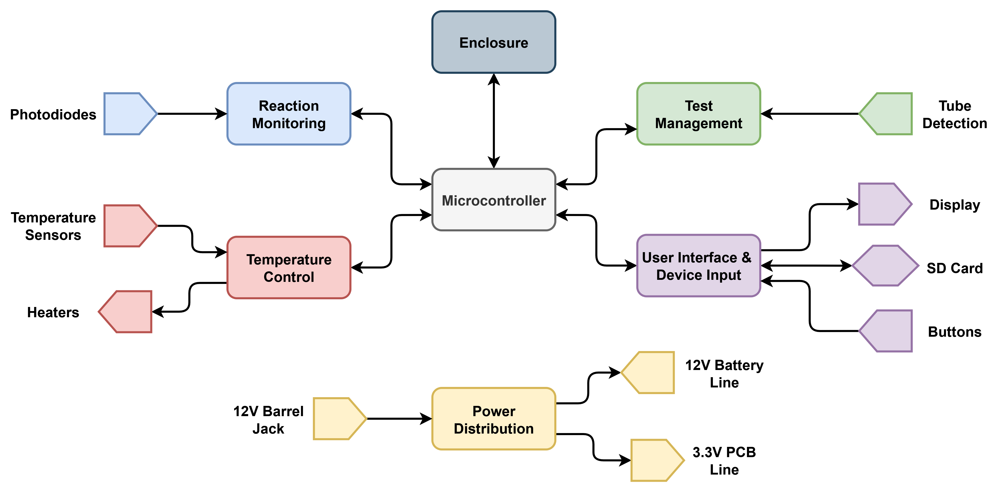
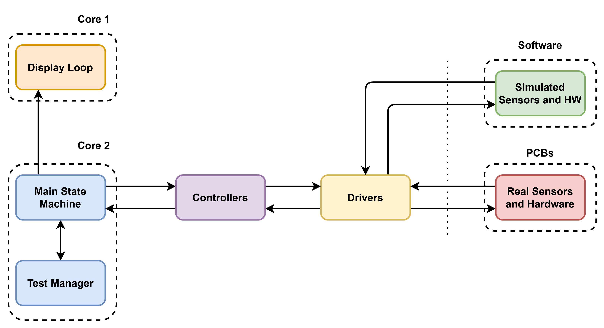
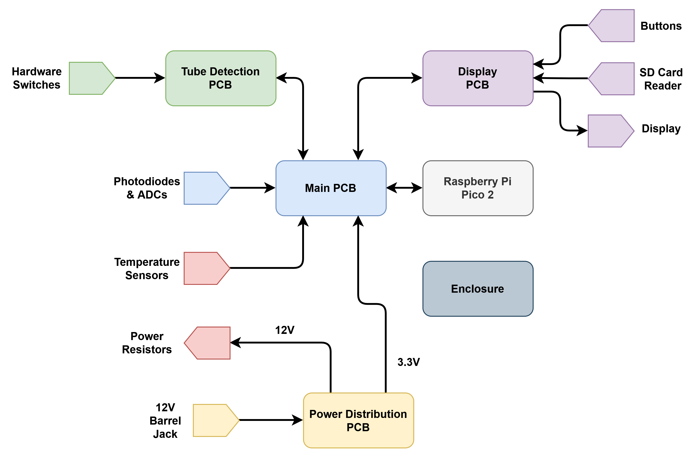

# Reaction Chamber for Pathogen Detection in Crops

Badges, platform, license, status

## About the Project
<!-- ##################### -->

Lorem ipsum dolor sit amet, consectetur adipiscing elit, sed do eiusmod tempor incididunt ut labore et dolore magna aliqua. Ut enim ad minim veniam, quis nostrud exercitation ullamco laboris nisi ut aliquip ex ea commodo consequat. 

## System Architecture
<!-- ##################### -->

### Block Diagram


### Images


### PCBs


## Software Architecture
<!-- ##################### -->

### Software Diagram


### State Diagram

### Hardware Abstraction

### Other Headers

## Hardware Overview
<!-- ##################### -->



## Design Decisions
<!-- ##################### -->

## Build and Flash Instructions
<!-- ##################### -->

### Prerequisites
* Raspberry Pi Pico SDK
  ```sh
  installation here
  ```
* CMake
  ```sh
  installation here
  ```

### Compilation and Flashing
While this project does make use of the Raspberry Pi Pico extension, there can be issues using it when first cloning the project. We are using CMake and Ninja for compilation, as is default for the Pico.
After pulling, navigate into the .\code\ directory
```
cd .\code
```
Create the build folder
```
New-Item -ItemType Directory -Name build ; cd build
```
Run CMake with Ninja, and build the project
```
cmake -G Ninja ..
ninja
```

### Running Tests


### License and Acknowledgements
MIT License 

Built for an industry partner as part of a capstone project. The implementation is original work.